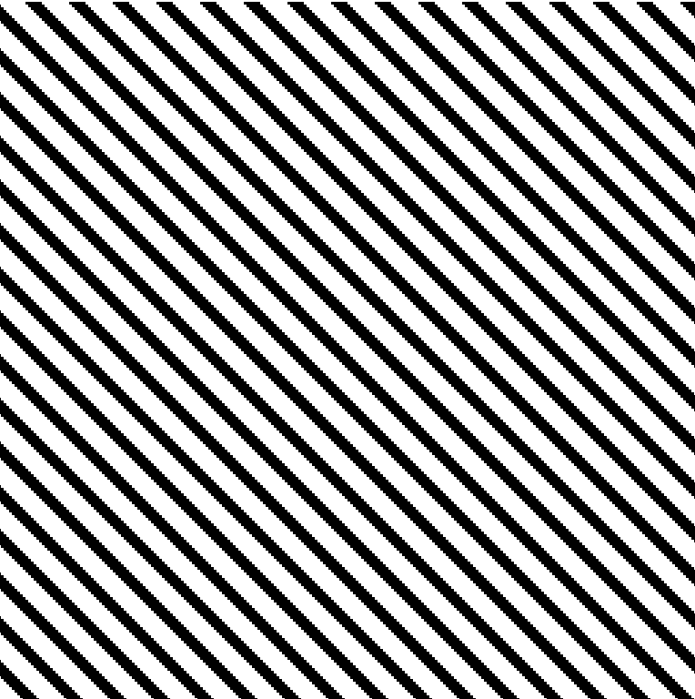

Quality of FFT depends heavily on the image quality.
Pixelated images or noise will lead to poor results, a.k.a. random frequencies.

example of low quality FFT due to pixelation:

Another note.
We did not get the original image files for this test.
Quality and size can change due to image grabbing.